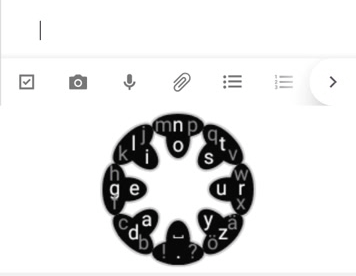

# Bloom input method
Keyboards where developped to move the hammers of a typewriter to the paper using physical buttons.
The physical buttons have gone; we are now staring at the screen to find these small buttons that
are ordered so that the hammers of the typewriter do not cling together.

Bloom is designed fom scratch to function optimally on touch screens. It allows the user to focus
on the written text, not on the writing itself. To get started Bloom does not require leaning
anything by heart.

Bloom has been available in the Google play store for a long time. Since march 2019 the source code has
been published to GiHub.

# How does Bloom work

## Overview
Bloom defines a very simple language consisting of only 3 different pen strokes and writing a dot.
Depending on the direction of the stroke, the meaning of the stroke is a different letter. The strokes
are the simplest possible:
* A straight stroke
* A slightly curved stroke
* A stroke with a loop in the middle

By writing these strokes in different directions, different letters are selected. 8 directions are used,
creating 45 degree sectors. For curve and looped stroke, also the side of the cure or loop affects the
selection of the letter. Bloom contains a display that shows the user to which stroke each letter is
assigned.

## Writing
### Short stroke
The simplest stroke is a short stroke, just about the size from the centrer of the circle to the innermost
ring of letters. The direction of the short stroke determines the letter you are writing.

# Privacy Policy
Arthur van der Knaap built the Bloom app as an Open Source app. This SERVICE is provided no cost and
is intended for use as is. The service does not collect any data.
